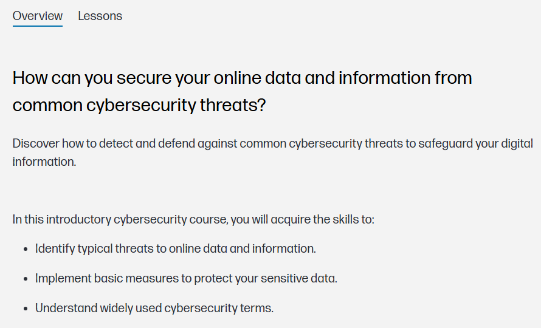
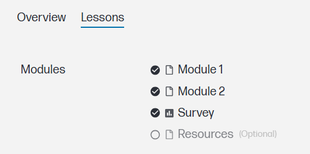

# 🔐 Introduction to Cybersecurity Awareness – HP LIFE

This repository contains **notes, labs, case studies, policy reviews, and certificate of completion** for the  
*Introduction to Cybersecurity Awareness* program by **HP LIFE**.  
The course introduces essential principles of **online safety, password security, phishing awareness, and data protection** —  
helping individuals and organizations strengthen their cybersecurity posture.

---

## 📚 Notes

| File | Description |
|------|--------------|
| [01-introduction.md](./notes/01-introduction.md) | Course introduction |
| [02-cyber-threats.md](./notes/02-cyber-threats.md) | Common types of cyber threats |
| [03-phishing-and-social-engineering.md](./notes/03-phishing-and-social-engineering.md) | Phishing & social engineering |
| [04-passwords-and-authentication.md](./notes/04-passwords-and-authentication.md) | Secure password and authentication practices |
| [05-secure-browsing.md](./notes/05-secure-browsing.md) | Safe browsing & online habits |
| [06-data-protection.md](./notes/06-data-protection.md) | Protecting sensitive data |
| [07-cybersecurity-at-work.md](./notes/07-cybersecurity-at-work.md) | Security in the workplace |
| [08-staying-safe-online.md](./notes/08-staying-safe-online.md) | Staying safe on the internet |

---

## 🧪 Labs

| Lab | Focus Area |
|-----|-------------|
| [01-password-security-lab.md](./labs/01-password-security-lab.md) | Password complexity & management |
| [02-phishing-awareness-lab.md](./labs/02-phishing-awareness-lab.md) | Identifying phishing emails |
| [03-device-protection-lab.md](./labs/03-device-protection-lab.md) | Device security and updates |
| [04-safe-internet-usage-lab.md](./labs/04-safe-internet-usage-lab.md) | Safe internet usage and browser hygiene |

---

## 🧩 Reports

| Report | Description |
|---------|--------------|
| [incident-analysis.md](./reports/incident-analysis.md) | Incident analysis: phishing credential theft case |
| [security-policy-review.md](./reports/security-policy-review.md) | Review of organizational security policies |
| [quarterly-summary-q4-2025.md](./reports/quarterly-summary-q4-2025.md) | Awareness training performance summary |

---

## 🔬 Extras

| File | Content |
|------|----------|
| [case-studies.md](./extras/case-studies.md) | Real-world awareness and security cases |
| [resources.md](./extras/resources.md) | Recommended readings and cybersecurity tools |
| [timeline.md](./extras/timeline.md) | Milestones in cybersecurity education |

---

## 📘 Docs

| File | Description |
|------|--------------|
| [index.md](./docs/index.md) | Course overview |
| [syllabus.md](./docs/syllabus.md) | Course syllabus |
| [roadmap.md](./docs/roadmap.md) | Learning roadmap |
| [references.md](./docs/references.md) | References & sources |
| [glossary.md](./docs/glossary.md) | Key cybersecurity terms |

---

## 📸 Screenshots

| Section | Screenshot |
|----------|-------------|
| 🧭 Course Overview |  |
| 📖 Lessons |  |

---

## 🎓 Certificate
📄 [Introduction to Cybersecurity Awareness – HP LIFE](./cert/certificate.pdf)

---

## 📝 Personal Reflection
This program reinforced my understanding of **everyday cybersecurity risks** and the importance of user awareness.  
The lessons emphasized how **human behavior is often the weakest link** — and how structured awareness programs  
can dramatically reduce threats like **phishing, credential theft, and weak password usage**.

It also provided useful insights for designing **cyber hygiene training modules** applicable to both personal  
and organizational contexts.

---

## ✍️ Author  

**Thành Danh** – Red Team Learner & Security Researcher  

- GitHub: [@ngvuthdanhh](https://github.com/ngvuthdanhh)  
- Email: ngvu.thdanh@gmail.com   

---

## 📄 License  

This project is licensed under the terms of the **MIT License**.  
See [`LICENSE`](./LICENSE) for full details.  

© 2025 ngvuthdanhh. All rights reserved.  
